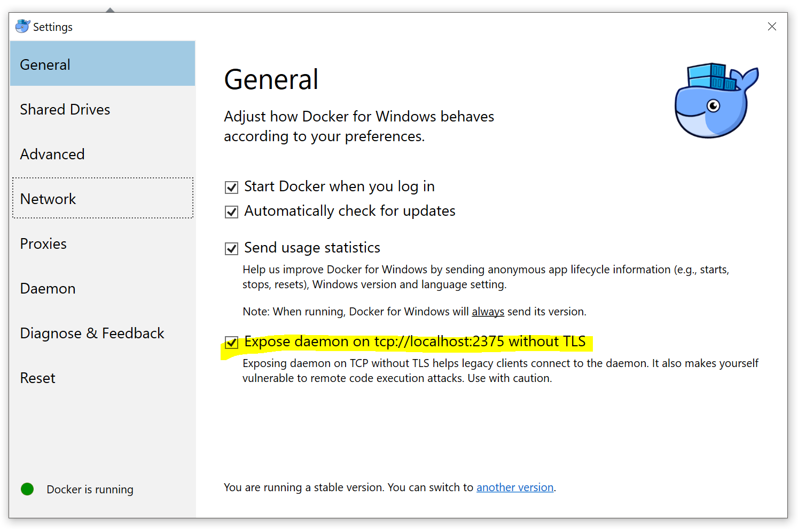

# Docker Prerequisites

## Linux
### Docker Distributions
1. [Docker Engine](https://docs.docker.com/engine/install/)

### Notes
Docker requires few additional configurations to run from a non-root user. You can configure it by following the
instructions [here](https://docs.docker.com/engine/install/linux-postinstall/#manage-docker-as-a-non-root-user).

## MacOS
### Docker Distributions
1. [Docker Desktop](https://docs.docker.com/desktop/mac/install/)
2. [Rancher Desktop](https://rancherdesktop.io/)

## Windows
### Docker Distributions
1. [Docker Desktop](https://docs.docker.com/desktop/windows/install/) 
2. [Rancher Desktop](https://rancherdesktop.io/)

### Notes
Docker for Windows users should enable remote access to the API.

